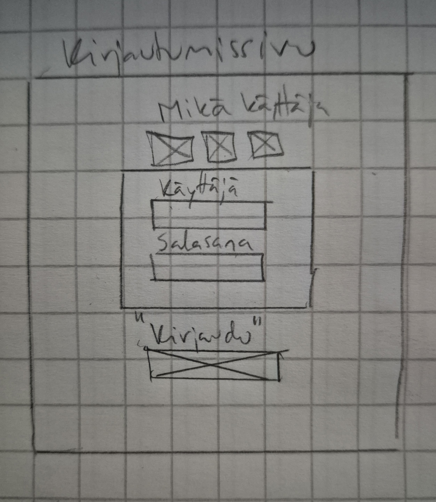
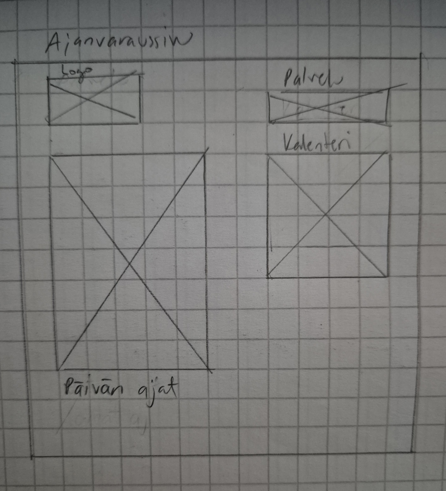

# 1. Vaihe - Määrittely ja suunnittelu

Projektin tarkoituksena on luoda terveydenhuoltoon sopiva ajanvarausjärjestelmä. Järjestelmässä tarkoituksena on, että asiakkaat voivat varata ja hallita aikojaan, sekä ammattihenkilö voi nähdä ja hallita omia aikoja. Myös vastaanottovirkailijalla tulee olemaan oikeudet nähdä ja muokata aikoja.

Lisäksi projektissa pyritään huomioimaan palvelun käytettävyyden tietoturva.

## 1. Käyttäjäprofiilit

**Asiakas, tavallinen käyttäjä**
- **Nimi:** Pekka
- **Ikä:** 35 vuotta
- **Ammatti:** Toimistotyöntekijä
- **Kuvaus:** Pekka on kiireinen toimistotyöntekijä, joka arvostaa helppokäyttöisiä ja luotettavia palveluita. Hän haluaa varata terveyteen liittyviä aikoja nopeasti ja turvallisesti ilman turhaa vaivannäköä. Hän odottaa, että järjestelmä toimii saumattomasti kaikilla laitteilla.
- **Tavoitteet ja tarpeet:** 
-- Varata ja hallita varaamiaan aikoja helposti ja nopeasti.
-- Luottaa siihen, että hänen henkilökohtaiset tietonsa ovat turvassa.

**Lääkäri, ammattihenkilö**
- **Nimi:** Emilia
- **Ikä:** 39 vuotta
- **Ammatti:** Yleislääkäri
- **Kuvaus:** Emilia on kokenut yleislääkäri, joka pitää vastaanottoaan yksityisellä palveluntuottajalla. Hän tarvitsee tehokkaan tavan hallita potilaidensa ajanvarauksia ja nähdä oman kalenterinsa, sekä klinikkansa varaukset. Emilia arvostaa järjestelmän selkeyttä ja luotettavuutta, jotta hän voi keskittyä potilaidensa hoitoon.
- **Tavoitteet ja tarpeet:**
-- Hallita ja tarkastella oman kalenterinsa ajanvarauksia.
-- Hallita ja tarkastella oman klinikkansa ajanvarauksia.
-- Tehdä, muokata ja peruuttaa ajanvarauksia helposti.

**Vastaanottovirkailija, admin**
- **Nimi:** Niilo
- **Ikä:** 49 vuotta
- **Ammatti:** Vastaanottovirkailija
- **Kuvaus:**  Niilo työskentelee klinikan vastaanotossa ja vastaa ajanvarausten hallinnasta sekä potilaiden vastaanottamisesta. Hänellä on admin-oikeudet, mikä tarkoittaa, että hän voi hallita kaikkia ajanvarauksia ja käyttäjätilejä. Niilo tarvitsee tehokkaan ja turvallisen järjestelmän, joka auttaa häntä hoitamaan päivittäiset tehtävät sujuvasti.
- **Tavoitteet ja tarpeet:**
-- Hallita ja tarkastella kaikkia ajanvarauksia klinikalla.
-- Tehdä, muokata ja peruuttaa ajanvarauksia.
-- Hallita käyttäjätilejä ja varmistaa, että kaikki tiedot ovat suojattuja.

## 2. Käyttötapaukset ja -tilanteet

**Käyttötilanne 1: Käyttäjän kirjautuminen**
- **Kuvaus:** Asiakas, tavallinen käyttäjä, haluaa kirjautua ajanvarausjärjestelmään varatakseen ajan lääkärille. 

**Vaiheet** 
1. Asiakas avaa kirjautumissivun ja syöttää sähköpostin ja salasanan.
2. Järjestelmä tarkistaa Annan tunnistetiedot ja myöntää JWT:n.
3. Asiakas pääsee ajanvarausjärjestelmään ja voi tehdä varauksen.

**Käyttötilanne 2: Ajanvarauksen tekeminen**
- **Kuvaus:** Asiakas haluaa varata ajan Lääkäri Emilialle. 

**Vaiheet**
1. Asiakas kirjautuu järjestelmään ja valitsee Lääkäri Emilian ja sopivan ajan.
2. Järjestelmä tarkistaa ajan saatavuuden ja Asiakas vahvistaa varauksen.
3. Järjestelmä tallentaa varauksen ja lähettää vahvistusviestin Asiakkaalle.

**Käyttötilanne 3: Ammattihenkilön ajanvarauksen hallinta**
- **Kuvaus:** Ammattihenkilö haluaa tarkastella ja hallita omaa kalenteriaan. 

**Vaiheet**

1. Ammattihenkilö kirjautuu järjestelmään ja näkee omat ajanvaraukset, varatut ja vapaat.
2. Ammattihenkilö tekee, muokkaa tai peruuttaa ajanvarauksia.
3. Järjestelmä tallentaa muutokset ja päivittää varaukset.

**Käyttötilanne 4: Tietojen suojaaminen**
- **Kuvaus:** Järjestelmä suojaa käyttäjän ja lääkärin tiedot hashauksella ja JWT:llä. 

**Vaiheet**

1. Asiakkaan ja ammattihenkilön salasanat tallennetaan hashattuina tietokantaan.
2. JWT käytetään tunnistamiseen ja valtuuttamiseen.
3. Järjestelmä tarkistaa JWT:n jokaisen pyynnön yhteydessä.

**Käyttötilanne 5: Admin voi hallita ajanvarauksia**
- **Kuvaus:** Vastaanottovirkailija, admin, voi peruuttaa tai siirtää varauksia järjestelmässä. 

**Vaiheet**

1. Admin kirjautuu järjestelmään.
2. Admin tarkastelee kaikkia ajanvarauksia.
3. Admin peruuttaa tai siirtää varauksia tarvittaessa.
4. Järjestelmä tallentaa muutokset ja päivittää varaukset.

## 3. Käyttöliittymän prototyypit

Käyttöliittymän prototyypit kattavat kaksi keskeistä näkymää: Kirjautumissivu ja Ajanvaraussivu, joiden toiminnallisuus vaihtelee käyttäjäroolin mukaan. Prototyypit on toteutettu piirtämällä ne paperille.

**Kirjautumissivu**

Kirjautumissivulla käyttäjä syöttää sähköpostiosoitteensa ja salasanansa. Ulkoasu on yksinkertainen ja se ohjaa käyttäjää tehokkaasti. 
Käytössä on seuraavat elementit:

- Valintapainike, sille onko sisäänkirjautuja asiakas, ammattihenkilö vai admin.

- Syötekentät sähköpostille ja salasanalle, joissa on selkeät paikkamerkit (placeholder-tekstit) ja virheilmoitukset väärän syötteen yhteydessä.

- "Kirjaudu sisään" -painike.

Kun käyttäjä kirjautuu sisään, järjestelmä tarkistaa tunnistetiedot JWT-autentikoinnilla ja ohjaa käyttäjän hänen roolinsa mukaiseen näkymään.

**Kirjautumissivun proto**

**Ajanvaraussivu**

Ajanvaraussivulla käyttäjä voi hallita ajanvarauksiaan. Käyttöliittymän ominaisuudet mukautuvat käyttäjäroolin perusteella:

- Tavallinen käyttäjä

Näkee vain omat ajanvarauksensa selkeässä kalenterinäkymässä.

Voi varata uuden ajan valitsemalla vapaan ajan ja vahvistamalla varauksen.

Voi perua varauksensa, jolloin järjestelmä päivittää tilanteen reaaliaikaisesti.

- Ammattihenkilö

Näkee oman aikataulunsa (listanäkymä + kalenteri).

Voi muokata ja perua potilasvarauksia.

Voi lisätä uusia aikoja, jos vastaanottopäiviin tulee muutoksia.

- Admin

Näkee ja hallitsee kaikkia varauksia ja käyttäjiä.

Voi lisätä, muokata ja poistaa ajanvarauksia tarpeen mukaan.

**Visuaalinen suunnittelu ja saavutettavuus**
Käyttöliittymän värimaailma ja typografia on valittu siten, että se on kontrastiltaan selkeä ja saavutettava (WCAG 2.1 -standardit).

Reaaliaikaiset ilmoitukset (esim. "Varaus onnistui!" tai "Peruutus tallennettu") antavat palautetta käyttäjälle.

## 4. Tietoarkkitehtuuri ja tekninen suunnittelu

**Projektin rakenne ja komponentit**
Projektissa on kolme pääkomponenttia, jotka yhdessä muodostavat ajanvarausjärjestelmän. Järjestelmä koostuu frontend- ja backend-osista sekä tietokannan rakenteesta. Kaikki järjestelmän osat on sijoitettu Azure-pilvipalveluun, mikä takaa järjestelmän skaalautuvuuden ja luotettavuuden.

**Frontend (React)**
Frontendin pohjana käytetään React-kirjastoa, joka mahdollistaa komponenttipohjaisen arkkitehtuurin. Tavoitteena on luoda käyttäjäystävällinen ja responsiivinen käyttöliittymä, jossa on selkeä navigointi ja sujuva vuorovaikutus. Kalenterinäkymä toteutetaan React-datepicker-kirjastolla, joka mahdollistaa päivämäärän ja ajan valinnan. React Router:ia käytetään eri sivujen navigointiin, kuten kirjautumissivulle ja kalenterisivulle.

**Backend (Node.js + Express)**
Backendin teknologiana käytetään Node.js:ää ja Express-kehystä, joka tarjoaa skaalautuvan ja nopean palvelinratkaisun. Node.js:n avulla pystytään käsittelemään HTTP-pyynnöt ja tarjoamaan API:t frontendille, kuten kirjautumisen ja ajanvarauksen hallinnan. JWT (JSON Web Token) -tunnistus käytetään käyttäjän autentikointiin ja valtuuttamiseen. API-pyynnöt tarkistavat JWT:n validiteetin ennen kuin ne palauttavat tietoja käyttäjälle.

**Tietokanta (PostgreSQL)**
Järjestelmässä käytetään PostgreSQL-tietokantaa. Tietokanta tallentaa käyttäjien tiedot (mm. nimi, sähköpostiosoite, salasana) ja ajanvaraukset (päivämäärä, kellonaika, käyttäjä). Käyttäjien salasanat tallennetaan bcrypt-algoritmilla hashattuina, mikä takaa tietoturvan.

**Tietoturva**
Järjestelmässä käytetään tietoturvatoimenpiteitä. Käyttäjien salasanat hashataan ja tallennetaan tietokantaan, jolloin ne eivät ole koskaan selkokielisinä saatavilla. JWT (JSON Web Token) -autentikointi mahdollistaa turvallisen käyttäjän tunnistamisen ja valtuuttamisen. JWT:tä käytetään kaikissa API-pyynnöissä varmistamaan, että vain kirjautuneet ja valtuutetut käyttäjät voivat käyttää järjestelmää.

**Järjestelmän skaalautuvuus ja ylläpidettävyys**
Järjestelmän skaalautuvuus ja ylläpidettävyys on huomioitu koko arkkitehtuurissa. Frontend ja backend on erotettu toisistaan, mikä mahdollistaa molempien osien kehittämisen ja skaalaamisen erikseen. Docker-säilöjen käyttö mahdollistaa sovelluksen siirtämisen eri ympäristöihin helposti. Järjestelmä toimii Azure-pilvipalvelussa, joka tarjoaa tarvittavat resurssit ja skaalautuvuuden. Tietokannan hallinta on järjestetty niin, että mahdollinen laajentaminen uusilla ominaisuuksilla on mahdollista.

**Käytetyt teknologiat**
- **Frontend:** React, React Router, React-datepicker

- **Backend:** Node.js, Express

- **Tietokanta:** PostgreSQL

- **Autentikointi:** JWT (JSON Web Token)

- **Salasanan hashäys:** bcrypt

- **Pilvipalvelu:** Azure

**Projektin tekninen suunnittelu ja arkkitehtuuri**
Projektin tietorakenne on suunniteltu niin, että kaikki tärkeimmät toiminnot on jaettu selkeisiin osiin. Backendin ja frontendin välinen rajapinta toteutetaan RESTful-tyylillä (kuten GET, POST, PUT, DELETE), mikä takaa yksinkertaisen ja laajennettavan arkkitehtuurin. Tietokannan taulut ja niiden suhteet on suunniteltu optimoidusti, jotta varauksia voidaan käsitellä nopeasti ja tehokkaasti. SQL-kyselyt on optimoitu hakemaan ja muokkaamaan tietoja mahdollisimman tehokkaasti.

## 5. Projektinhallinta ja käyttäjätestaus

**Projektinhallinta**
Projektin hallinta perustuu ketterään Scrum-menetelmään, jossa työskennellään iteratiivisesti ja reagoidaan tarvittaessa muutoksiin. Projektin aikaraja on noin 1 kuukausi, ja sen aikana on sovittu selkeät välitavoitteet ja arvioinnit, joiden perusteella seurataan edistymistä.

**Projektin vaiheet ja aikaraja:**

1. **Määrittely ja suunnittelu (viikko 1):** Projektin alussa määritellään tarkasti projektin tavoitteet ja tekniset vaatimukset. Käyttötapaukset, tekninen suunnitelma, arkkitehtuuri ja käyttöliittymän prototyypit. Samalla varmistetaan, että projektissa käytettävät teknologiat (React, Node.js, PostgreSQL, JWT, Azure) ovat määritelty.

2. **Perusrunko ja päätoiminnallisuudet (viikko 2-3):** Tällä aikavälillä rakennetaan perusrunko Reactin avulla ja luodaan taustajärjestelmä Node.js/Express -ympäristössä. Koodin laatu ja dokumentointi ovat keskiössä. Käyttäjien autentikointi toteutetaan JWT:llä, ja käyttäjärekisteröinti ja kirjautuminen ovat ensimmäisiä toiminnallisuuksia, joita aletaan kehittämään.

3. **Testaus ja virheenkäsittely (viikko 4):** Testaus keskittyy sovelluksen eri osien toimivuuteen, erityisesti varausjärjestelmän osalta. Käyttäjien kirjaaminen ja varauksen hallinta ovat keskiössä. Virheenkäsittelymekanismit rakennetaan siten, että virheilmoitukset ovat selkeitä ja auttavat loppukäyttäjiä korjaamaan mahdolliset virheet.

**Aikataulun seuranta ja muutokset:** Aikataulun ja työtehtävien hallintaa varten käytetään yksinkertaista lokikirjaa, johon merkitaan päivä, käytetty aika ja tehdyt tehtävät. Tavoitteena on pitää kiinni aikarajoista ja reagoida joustavasti mahdollisiin esteisiin. 

**Käyttäjätestaus**
Käyttäjätestaus toteutetaan iteratiivisesti kehityksen eri vaiheissa, ja se perustuu aitoihin käyttäjiin ja heidän vuorovaikutukseensa järjestelmän kanssa.

Testausjaksoissa keskitytään erityisesti käyttöliittymän ja toiminnallisuuksien testaukseen. Testauksessa otetaan huomioon eri käyttäjäpersoonat ja heidän tarpeensa, kuten esimerkiksi ajanvarausten tekeminen ja tarkasteleminen sekä muokkaaminen.

**Testit suoritetaan seuraavasti:**

- **Alustavat testit:** Suoritetaan prototyypillä ja yksinkertaisella käyttöliittymällä jonka avulla voidaan testata perustoiminnallisuudet ja käytettävyys.

- **Funktionaaliset testit:** Testataan järjestelmän eri toimintoja, kuten kirjautumista, ajanvarausten tekemistä ja peruutuksia.
- **Testausskenaariot:**
1. Kirjautuminen jäjestelmään asiakkaan tunnuksilla ja ajan varaaminen
2. Kirjautuminen järjestelmään ammattihenkilön tunnuksilla ja omien aikojen muokkaaminen
3. Kirjautuminen järjestelmään admin tunnuksilla ja aikojen muokkaaminen.

- **E2E-testit (End-to-End):** Koko järjestelmän toimivuus testataan eri skenaarioilla, jolloin varmistetaan, että kaikki toiminnot ja komponentit toimivat yhteen sujuvasti.

- **Kuormitustestaus:** Testataan järjestelmän kyky käsitellä useita samanaikaisia käyttäjiä ja varmistetaan, että palvelin pystyy käsittelemään kuormitusta ilman merkittäviä viiveitä.

**Testauksien tulosten mittarit:**
- Ajan mittaaminen testiskenaarioiden toteuttamisessa
- Virheilmoitukset esimerkiksi E2E-testauksessa
- Käyttäjätestaajien kommentit